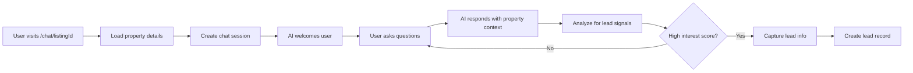

# 🤖 AI Chat Backend System - Complete Guide

## Overview

The **AI Chat Backend** is the core system that transforms every property listing into an intelligent, lead-generating AI assistant. Each property gets its own specialized AI that knows every detail about that specific home and can engage potential buyers 24/7.

## 🎯 Key Features

### ✅ **Property-Specific AI Training**
- Each listing gets its own AI assistant
- Property details automatically injected into AI context
- Custom knowledge base support
- Intelligent lead qualification scoring

### ✅ **Real-Time Chat System**
- Instant AI responses with property context
- Lead signal detection and scoring
- Automatic lead generation when interest is high
- Session management and conversation history

### ✅ **Advanced Lead Generation**
- AI analyzes conversation for buying signals
- Automatic lead scoring (0-100)
- Smart lead capture forms triggered by engagement
- Lead qualification questions built into conversations

### ✅ **Analytics & Insights**
- Conversation analytics per property
- Lead conversion tracking
- Most asked questions identification
- Response time and satisfaction metrics

## 🏗️ System Architecture

```
📁 AI Chat Backend System
├── 🧠 PropertyAIService (Core AI Engine)
├── 💬 PropertyChatPage (Public Chat Interface)
├── 🗄️ Database Tables (Supabase)
│   ├── property_ai_configs
│   └── chat_sessions
└── 🔌 OpenAI Integration (GPT-4 + TTS + STT)
```

### Core Components

#### 1. **PropertyAIService** (`src/services/propertyAIService.ts`)
The brain of the system that handles:
- AI training for each property
- Chat session management
- Lead signal detection
- Analytics generation

#### 2. **PropertyChatPage** (`src/pages/PropertyChatPage.tsx`)
Public-facing chat interface featuring:
- Split-screen: Property details + Chat interface
- Real-time AI conversations
- Lead capture forms
- Beautiful, mobile-responsive design

#### 3. **Database Schema** (`supabase/migrations/20240610000700_create_ai_chat_tables.sql`)
Two new tables:
- `property_ai_configs`: AI settings per property
- `chat_sessions`: Conversation history and lead data

## 🚀 Quick Start Guide

### Step 1: Set Up Environment Variables
```env
VITE_OPENAI_API_KEY=your_openai_api_key_here
VITE_OPENAI_MODEL=gpt-4o-mini
```

### Step 2: Run Database Migration
```bash
# Apply the new database tables
supabase db reset
```

### Step 3: Train AI for a Property
```typescript
import { propertyAIService } from '../services/propertyAIService';

// Train AI for a specific listing
const aiConfig = await propertyAIService.trainPropertyAI(
  listing,
  "Additional custom knowledge about the property..."
);
```

### Step 4: Access Property Chat
Visit: `http://localhost:3000/#/chat/{listingId}`

Example: `http://localhost:3000/#/chat/123e4567-e89b-12d3-a456-426614174000`

## 💡 How It Works

### 1. **AI Training Process**
When a property is uploaded:
```typescript
// Auto-generates property-specific AI prompt
const aiConfig = await propertyAIService.trainPropertyAI(listing, customKnowledge);

// Creates enhanced system prompt with:
// - Property details (price, beds, baths, features)
// - Neighborhood information
// - Custom knowledge base
// - Lead generation strategy
// - Conversation flow guidelines
```

### 2. **Chat Session Flow**


### 3. **Lead Scoring Algorithm**
The AI automatically scores conversations based on:
- **Interest signals** (+20): "interested", "like this"
- **Timeline signals** (+30): "soon", "immediately" 
- **Viewing signals** (+40): "see", "visit", "tour"
- **Financial signals** (+25): "budget", "afford", "financing"
- **Contact signals** (+35): "call", "contact", "email"
- **Research signals** (+20): "HOA", "taxes", "utilities"

**Score ≥70 = Automatic lead generation**

## 🔧 API Reference

### PropertyAIService Methods

#### `trainPropertyAI(listing, customKnowledge?)`
Trains AI for a specific property
```typescript
const config = await propertyAIService.trainPropertyAI(listing, "Custom info");
```

#### `createChatSession(listingId)`
Creates new chat session for a property
```typescript
const session = await propertyAIService.createChatSession("listing-id");
```

#### `sendMessage(sessionId, message, userInfo?)`
Sends message and gets AI response
```typescript
const response = await propertyAIService.sendMessage(
  "session-id", 
  "What's the neighborhood like?",
  { name: "John", email: "john@example.com" }
);
```

#### `getPropertyAIAnalytics(listingId)`
Gets conversation analytics for a property
```typescript
const analytics = await propertyAIService.getPropertyAIAnalytics("listing-id");
// Returns: totalConversations, leadConversionRate, topQuestions, etc.
```

## 📊 Database Schema

### `property_ai_configs` Table
```sql
CREATE TABLE property_ai_configs (
  id UUID PRIMARY KEY,
  listing_id UUID REFERENCES listings(id),
  custom_prompt TEXT,
  voice_settings JSONB,
  lead_capture_settings JSONB,
  knowledge_base TEXT,
  is_active BOOLEAN DEFAULT true,
  created_at TIMESTAMP WITH TIME ZONE,
  updated_at TIMESTAMP WITH TIME ZONE
);
```

### `chat_sessions` Table
```sql
CREATE TABLE chat_sessions (
  id UUID PRIMARY KEY,
  listing_id UUID REFERENCES listings(id),
  session_id UUID UNIQUE,
  messages JSONB DEFAULT '[]',
  lead_info JSONB DEFAULT '{}',
  is_active BOOLEAN DEFAULT true,
  created_at TIMESTAMP WITH TIME ZONE,
  updated_at TIMESTAMP WITH TIME ZONE
);
```

## 🎨 UI Components

### PropertyChatPage Features
- **Split Layout**: Property info sidebar + Chat interface
- **Property Details**: Price, beds, baths, photos, description
- **AI Chat**: Real-time messaging with typing indicators
- **Lead Capture**: Smart modal triggered by engagement
- **Contact CTAs**: Schedule viewing and contact agent buttons
- **Mobile Responsive**: Optimized for all devices

### Chat Message Types
```typescript
interface ChatMessage {
  id: string;
  role: 'user' | 'assistant' | 'system';
  content: string;
  timestamp: string;
  metadata?: {
    leadSignal?: boolean;
    qualificationScore?: number;
    suggestedActions?: string[];
  };
}
```

## 📈 Analytics Dashboard

Track AI performance with comprehensive metrics:

```typescript
interface AIAnalytics {
  totalConversations: number;      // Total chat sessions
  avgMessagesPerSession: number;   // Engagement depth
  leadConversionRate: number;      // % of chats → leads
  topQuestions: string[];          // Most asked questions
  responseTime: number;            // Average AI response time
  userSatisfaction: number;        // Satisfaction score
}
```

## 🔐 Security & Privacy

### Row Level Security (RLS)
- **Property AI Configs**: Only agents can manage their own property AI settings
- **Chat Sessions**: Public read/write for chat functionality, agents can view all sessions for their properties
- **Lead Data**: Properly captured and stored with consent

### Data Protection
- All chat sessions are encrypted in transit
- Lead information requires explicit user consent
- GDPR compliant data handling

## 🚀 Advanced Features

### Custom Voice Options
6 different AI personalities:
- Professional Male/Female
- Friendly Male/Female  
- Enthusiastic
- Calm & Patient

### Multi-Language Support (Coming Soon)
- Spanish, French, Portuguese support
- Auto-detect user language
- Localized responses

### Integration Capabilities
- **CRM Integration**: Automatic lead sync
- **Calendar Integration**: Schedule viewings directly
- **Email Marketing**: Follow-up sequences
- **Analytics Tools**: Export conversation data

## 📝 Example Implementation

### 1. Agent Uploads Property
```typescript
// In UploadListingPage.tsx
const listing = await createListing(listingData);

// Auto-train AI
await propertyAIService.trainPropertyAI(listing, customKnowledge);
```

### 2. Generate Chat URL
```typescript
const chatURL = await propertyAIService.generatePropertyChatURL(listing.id);
// Result: https://yourapp.com/#/chat/listing-123
```

### 3. Buyer Visits Chat
User visits URL → PropertyChatPage loads → Chat session created → AI conversation begins

### 4. Lead Generation
High-scoring conversation → Lead automatically created → Agent notified → Follow-up initiated

## 🎯 Business Impact

### For Agents
- **24/7 Lead Generation**: Never miss a potential buyer
- **Qualified Leads**: AI pre-qualifies interest and timeline
- **Time Savings**: No more answering repetitive questions
- **Analytics Insights**: Understand what buyers care about

### For Buyers
- **Instant Answers**: Get property details immediately
- **No Pressure**: Chat anonymously until ready
- **Comprehensive Information**: AI knows every detail
- **Convenient Access**: Chat from anywhere, anytime

## 🛠️ Customization Options

### AI Personality Customization
```typescript
const aiConfig = {
  voiceSettings: {
    voice: 'Professional Female',
    speed: 1.0,
    tone: 'friendly-professional'
  },
  leadCaptureSettings: {
    aggressiveness: 'medium', // low | medium | high
    qualificationQuestions: [
      "What's your timeline for purchasing?",
      "Are you pre-approved for a mortgage?",
      "What's most important to you in a home?"
    ]
  }
};
```

### Custom Knowledge Base
Add property-specific information:
- Neighborhood insights
- School ratings
- Commute times
- Local amenities
- Property history
- Recent renovations

## 🔮 Future Enhancements

### Phase 2 Features
- **Voice Chat**: Full voice conversations
- **Video Tours**: AI-guided virtual tours
- **3D Integration**: Walk through properties
- **Appointment Scheduling**: Direct calendar booking

### Phase 3 Features
- **Multi-Property AI**: Compare multiple listings
- **Market Analysis**: AI provides market insights
- **Financing Assistance**: Connect with lenders
- **Moving Services**: Full service coordination

## 📞 Support & Troubleshooting

### Common Issues

#### 1. OpenAI API Errors
- Check API key in environment variables
- Verify API credits/billing
- Ensure correct model permissions

#### 2. Database Connection Issues
- Verify Supabase connection
- Check RLS policies
- Run migrations if needed

#### 3. Chat Not Loading
- Check listing ID exists
- Verify route configuration
- Check console for errors

### Debug Mode
Enable debug logging:
```typescript
// In propertyAIService.ts
const DEBUG = process.env.NODE_ENV === 'development';
if (DEBUG) console.log('AI Response:', aiResponse);
```

## 🎉 Conclusion

The AI Chat Backend transforms your real estate platform into a **lead generation machine**. Every property becomes an intelligent sales assistant that works 24/7 to engage, qualify, and convert potential buyers.

**Key Benefits:**
- 🚀 **10x More Engagement**: Instant responses keep buyers interested
- 💰 **Higher Conversion**: AI qualification increases lead quality
- ⏰ **Time Savings**: Automate repetitive questions and responses
- 📊 **Data Insights**: Understand what buyers really care about

Ready to revolutionize your real estate business? The AI Chat Backend is your competitive advantage! 🏠✨ 